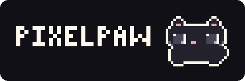
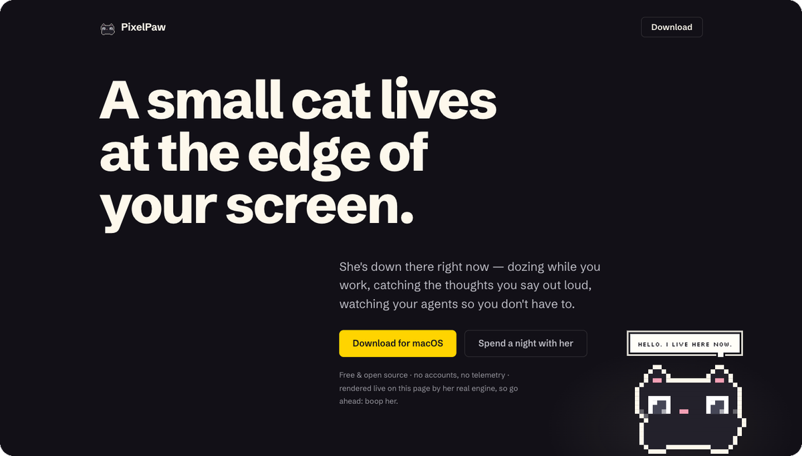
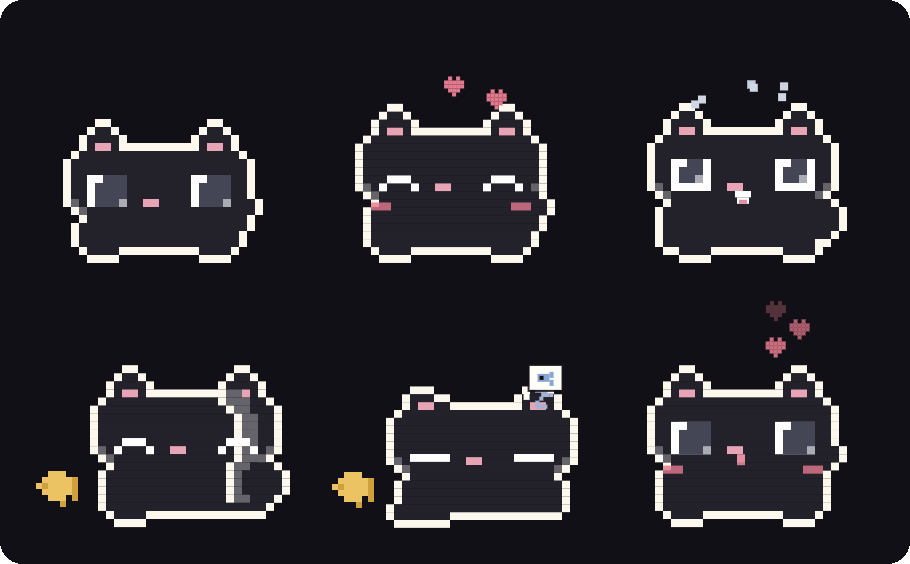
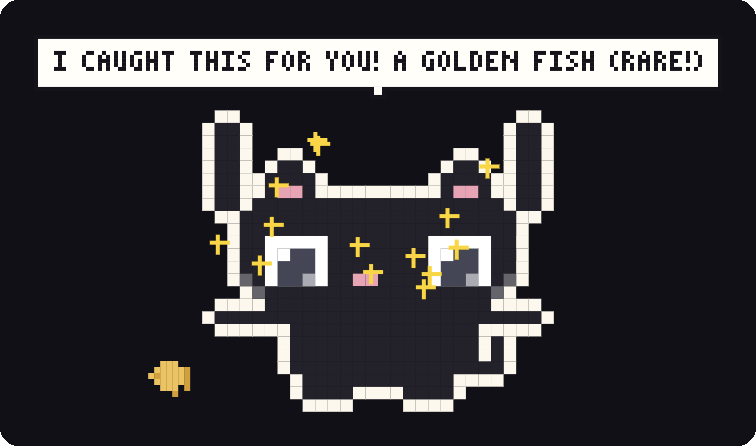
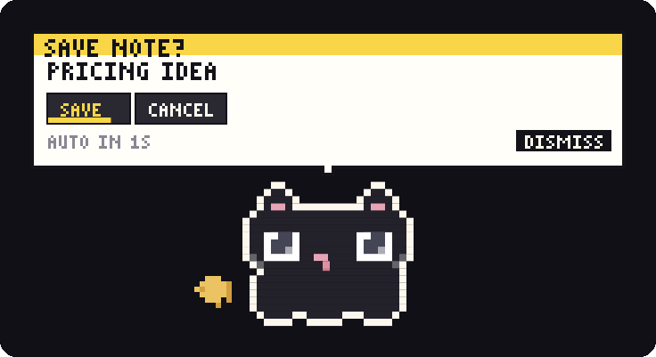
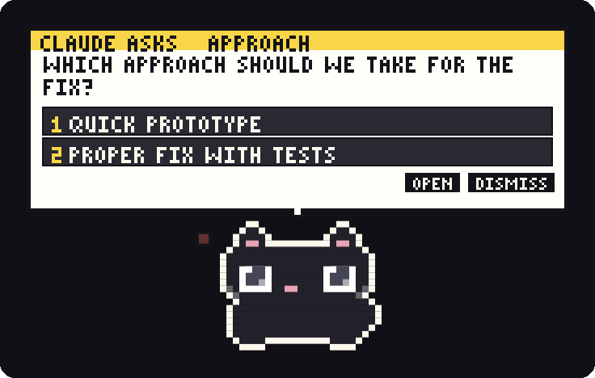
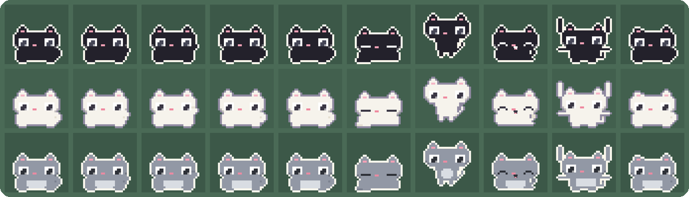

<div align="center">
  

  <p><em>A small cat lives at the edge of your screen.</em></p>

  <p>
    
    
    
    
  </p>

  <p>
    <a href="#quick-start">Quick start</a> ·
    <a href="#what-she-does">What she does</a> ·
    <a href="#she-watches-your-ai-agents">Agents</a> ·
    <a href="#talk-to-her-from-anywhere">API</a> ·
    <a href="#how-shes-made">How she's made</a> ·
    <a href="#how-shes-tested">Tests</a>
  </p>

  
</div>

<br />

PixelPaw is a pixel cat who lives at the edge of your macOS screen. She watches
your cursor, kneads while you type, and builds a real relationship over weeks:
morning greetings, streaks with weekend grace, small gifts left overnight. She
is also an ambient interface — press <kbd>⌃⌥Space</kbd> and a spoken thought
becomes a to-do, a note, or a command typed into a live AI-agent terminal,
always behind a confirmation chip, always undoable.

Every pixel is drawn by code. There are no image files, no fonts, no sounds;
her entire anatomy is ASCII art in [`renderer/sprites.js`](renderer/sprites.js),
and even the purr is synthesized. She began as a study of
[comnyang](https://comnyang.com/), the original desktop cat, rebuilt from
scratch.

## Quick start

From clone to cat in about two minutes. Needs macOS 13+ and Node ≥ 22.12.

```bash
git clone https://github.com/anuruddh/pixelpaw
cd pixelpaw
npm install   # one dependency, prebuilt for Apple Silicon and Intel
npm start
```

She appears bottom-right, introduces herself, and a cat icon lands in your
menu bar.

- **Boop** — click her nose
- **Pet** — stroke her head with the cursor
- **Menu** — hold her for a moment, right-click her, or press <kbd>⌃⌥C</kbd> anywhere
- **Settings** — double-click her

Mouse play needs no permissions at all. To feel you type and scroll she asks
for **Accessibility**, and the microphone prompt appears the first time you
press <kbd>⌃⌥Space</kbd>; both are explained in plain language when they come
up. Voice, the brain, and agent hooks are all optional. She is a whole cat
without them.

> There is no packaged .app yet; she runs from source. A notarized app is the
> one item on the roadmap.

<details>
<summary>If typing reactions stay quiet</summary>

Grant Accessibility to your terminal (or to Electron) in System Settings →
Privacy & Security → Accessibility, then restart her. macOS caches the denial
per process, so the restart matters.

</details>

## What she does

### She's alive



- **Her eyes follow your cursor** anywhere on the screen, and her pupils
  dilate when you come close.
- **Move the mouse fast and she hunts it** — chase, wiggle-butt crouch,
  pounce.
- **Pet her** with slow strokes: purring, hearts, blush.
- **Boop her nose** and she squashes, slow-blinks, and occasionally mlems.
- **She kneads while you type.** Type like a maniac and she overheats and
  steams; her fur never turns red, a test enforces it.
- **Scroll and she unrolls a paper** under her paws.
- **Left alone, she has rituals**: washing up, ear flicks, tail wrapped around
  her paws, a curious head-tilt when you hover, the rare blep.
- **She naps** in a loaf, dreams of fish (ears twitching), and wakes with a
  yawn and a startled `!`.
- **Drag her** and she dangles, then wobbles like mochi when you let go.

<br clear="both" />

### She remembers you



- **Bond levels change how she behaves**, not what she can do — more hearts
  when petted, zoomies for old friends. No visible numbers, ever.
- **Morning greetings** with your day's due count; a proper reunion if you
  were away.
- **Streaks with weekend grace**: Saturdays and Sundays never break them.
- **Overnight gifts** — a leaf, a bottle cap, once a beetle — set at her feet,
  kept on a shelf in her menu. Twelve to find.
- **An evening wind-down**: around 6:30 she offers to sweep today's leftovers
  to tomorrow at nine. Once, and only if something's actually due.
- **A while-you-were-away digest**: one bubble (*2 agent runs · 1 ask · 1
  due*) that opens her inbox.
- **Make her yours**: name her, pick fur styles, or photograph your real cat
  and she matches the palette and face markings, down to a pixel-level
  marking editor.

<br clear="both" />

### Say it out loud



- Press <kbd>⌃⌥Space</kbd>, say one sentence, go quiet. Transcription runs
  **on your machine** through a local CLI you point her at.
- She works out the intent and shows **chips before anything happens**, with
  a three-second countdown you can cancel.
- *"Remind me to send the invoice at four"* → a to-do with a due time.
  Reminders that slip **come back with choices** (done · +30m · tonight ·
  drop), once more after that, then rest. She never nags.
- *"Note: pricing needs a floor"* → appended to a daily markdown file in
  `~/notes/`.
- *"What's the flag for force-with-lease?"* → a short answer in a bubble.
- **Everything is undoable for eight seconds** — the to-do, the note, the
  capture. One tap and it never happened.

<br clear="both" />

<details>
<summary>The complete list</summary>

| Thing | What happens |
| --- | --- |
| Eye follow | pupils track the cursor across the screen |
| Hunt | fast cursor → chase → crouch + wiggle → pounce |
| Drag | she hangs from the cursor, mochi-wobbles on release |
| Petting | strokes over her head → purr + hearts + blush |
| Boop | click her nose → squash, slow-blink, sometimes a mlem |
| Kneading¹ | typing → she kneads; sustained speed → overheat + steam |
| Paper roll¹ | scrolling unrolls a paper under her |
| Idle rituals | grooming, ear flicks, tail wrap, head tilt, blep |
| Sleep | loaf, dream-of-fish bubbles, yawn on wake |
| Bond | levels gate behavior (hearts, zoomies), never stats |
| Rituals | morning greeting, reunions, overnight gifts, shelf, journal |
| Streaks | daily, with weekend grace |
| To-dos | `@ 4pm` / `@ +30m` grammar, follow-up chips, wind-down sweep |
| Voice | ⌃⌥Space → local transcription → intent chips → undo |
| Quick answers | questions come back as a bubble (optional brain) |
| Notes | daily markdown files in a folder you choose |
| Away digest | one catch-up bubble after 2+ hours away |
| Pomodoro | menu-bar timer, she stretches with you on breaks |
| Reminders | meow at a time, pinned note above her head |
| Agents | status LED, celebrations, question relay, typed answers |
| Customization | name, fur styles, photo-matched skin, pixel marking editor |
| Hide/show | she leaves a note telling you how to call her back |

¹ needs the Accessibility permission.

</details>

## She watches your AI agents



If you run Claude Code or Codex, she becomes the calmest status surface
you've ever had: a cat with a tiny LED.

- **Amber breath** while an agent thinks. Hover the LED and she tells you
  who's running, doing what, since when. Click it to jump to that terminal.
- **One hop per finished turn.** Quick turns get a quiet nod; bursty
  pipelines are rate-limited; background and headless runs file into her
  inbox instead of interrupting you.
- **Questions arrive as chips on her.** Click an answer and she focuses the
  exact iTerm2/Terminal tab and types it for you.
- **Speak to a session**: *"tell claude to run the tests."* She finds it,
  asks you first, types the command into the prompt, and leaves the Enter
  key to you.

Anything can drive her:

```bash
curl -X POST http://127.0.0.1:41999/agent \
  -H "Content-Type: application/json" \
  -d '{"agent":"ci","state":"done"}'   # thinking | done | alert | idle
```

Wiring up Claude Code or Codex is two button presses — see
[Optional powers](#optional-powers).

<br clear="both" />

## House rules

A creature with a permanent spot on your screen has to deserve it. Hers are
non-negotiable:

- **She asks first.** Chips before anything happens. Typing into your
  terminal always takes a click; nothing is ever auto-sent.
- **Undo follows everything.** Eight seconds to take it back: the to-do, the
  note, the capture.
- **No guilt, ever.** Missed reminders stop asking after two nudges. Absence
  gets a reunion, not a report card.
- **Your machine, your words.** Voice is transcribed on-device. The optional
  brain has a daily cap with a visible meter. Notes are plain markdown in
  your folder.
- **Nothing phones home.** No account, no telemetry. She is a local process
  talking to herself on 127.0.0.1.
- **Readable to the last pixel.** Every frame of her is ASCII art in one
  file.

## Talk to her from anywhere

| Surface | Looks like |
| --- | --- |
| `pawcat` CLI | `pawcat todo "review the PR @ 3pm"` |
| HTTP | `curl -X POST 127.0.0.1:41999/say -d '{"text":"DEPLOY DONE"}'` |
| Deep links | `open "pixelpaw://say?text=hi"` — Shortcuts, Raycast, browsers |
| MCP | `cat_say` · `cat_todo` · `cat_list_tasks` · `cat_status` · `cat_voice` |

All four proxy the same local API, which only ever binds to 127.0.0.1.

<details>
<summary>Full HTTP reference</summary>

`GET /health` · `GET /status` (sessions, tasks, bond, voice, pomodoro)

`POST /say {text}` · `/todo {text}` · `/voice {text}` · `/menu` · `/show` ·
`/hide` · `/url {url}` · `/agent {agent, state, interactive?}` ·
`/hook/claude/<prompt|stop|notification|ask|ask-done|end>` ·
`/hook/codex/notify`

Default port 41999; override with the `PIXELPAW_PORT` env var (CLI/MCP) and
the port field in Settings → AI AGENTS (app).

</details>

## Optional powers

Everything in this section is opt-in and reversible, and she is a whole cat
without any of it. The two installs that touch config files
(`~/.claude/settings.json`, `~/.codex/config.toml`) happen only when you
press the button in her settings, and both write a backup next to the file
first.

<details>
<summary><b>pawcat</b> — talk to her from any terminal</summary>

1. From the repo root: `npm link`
2. `pawcat say "deploy finished"` · `pawcat todo "standup @ 9:30"` ·
   `pawcat talk "remind me to stretch at 5"` · `pawcat status`
3. Remove any time with `npm unlink -g pixelpaw`.

</details>

<details>
<summary><b>MCP</b> — let agents use her as native tools</summary>

1. From the repo root:
   `claude mcp add pixelpaw -s user -- node "$(pwd)/tools/mcp-server.js"`
2. `claude mcp list` should show `pixelpaw`.
3. Agents now have `cat_say`, `cat_todo`, `cat_list_tasks`, `cat_status`,
   and `cat_voice`. Remove with `claude mcp remove pixelpaw`.

</details>

<details>
<summary><b>Claude Code hooks</b> — she narrates your sessions</summary>

1. Double-click her → Settings → AI AGENTS.
2. Press INSTALL HOOKS. Six hooks land in `~/.claude/settings.json`; a
   backup is saved next to it first.

That's the whole install. UNINSTALL on the same page restores things. What
each hook does:

| Hook | Her reaction |
| --- | --- |
| UserPromptSubmit | working LED + thinking face |
| Stop | a hop and a meow (quiet nod for short turns) |
| Notification | the actual message, on the cat |
| AskUserQuestion (pre/post) | question chips appear and clear |
| SessionEnd | tidy up the session |

She touches that file only when you press the button.

</details>

<details>
<summary><b>Codex notify</b> — done celebrations for Codex CLI</summary>

Same two-press pattern into `~/.codex/config.toml`, backup first. If you
already have a custom `notify` hook she refuses to overwrite it and asks you
to merge manually. Honest scope note: Codex only exposes turn-completion to
external hooks, so this is done-celebrations only.

</details>

<details>
<summary><b>Voice and the brain</b> — speak to her</summary>

1. Voice needs a local speech-to-text CLI. Point Settings → VOICE at any
   Murmur-style CLI, or install
   [whisper.cpp](https://github.com/ggml-org/whisper.cpp) (`whisper-cli` is
   auto-detected on PATH) and set a ggml model path. The tab shows what she
   found.
2. Press <kbd>⌃⌥Space</kbd>, allow the microphone, speak.
3. Intent routing works out of the box with a built-in router. For the
   smarter path, install
   [Claude Code](https://docs.anthropic.com/en/docs/claude-code) and sign
   in; she routes through `claude -p` (Haiku, one short call per utterance)
   with a daily cap and a visible usage meter.
4. Without either, nothing breaks. As `lib/brain.js` puts it: *the cat keeps
   working without a brain, just dumber.*

</details>

## How she's made

```text
main.js            the entire main process: window, tray, a single 60 Hz loop,
                   schedulers, the local HTTP API, hooks, pomodoro, the bond
preload.js         the narrow IPC bridge
renderer/
  cat.js           her state machine: moods, gestures, menu, panels, on canvas
  sprites.js       her entire anatomy — every frame is ASCII art
  font.js          the pixel font, also drawn in code
  audio.js         synthesized chiptune purrs and meows, no audio files
  voice.js         microphone capture to WAV, in the renderer
  gifts.js         twelve pixel treasures she can leave overnight
  palette.js       photo → skin: k-means with a fur-color prior
lib/
  brain.js         one utterance in, one validated intent out; `claude -p`
                   with a regex fallback
  transcribe.js    WAV → text through a local CLI; nothing leaves the machine
  claudeHooks.js   installs/uninstalls the six Claude Code hooks, with backup
  codexHooks.js    wires Codex's notify hook, with backup
  focusTty.js      finds the terminal tab a session lives in and types for you
  store.js         settings and state, one JSON file
tools/
  scenarios.js     the 66-scenario behavior suite
  pawcat.js        the CLI
  mcp-server.js    MCP over stdio: hand-rolled JSON-RPC, zero dependencies
  preview.js       sprite contact sheets without opening the app
site/              the landing page; the same sprite engine renders a living cat
```

**How it works**

- She is a transparent, always-on-top, click-through window that becomes
  interactive only while your cursor is over her.
- Global keyboard and scroll come from `uiohook-napi`, the project's only
  runtime dependency, with prebuilds for both Mac architectures.
- One 60 Hz loop in the main process drives drag physics, the hunt, and the
  schedulers, and ticks the renderer over IPC at 30 Hz.
- Zero assets: sprites, font, icons, gifts, and sounds are all generated,
  which is why the repo is this small.

## How she's tested

`npm test` boots a real Electron instance in an isolated per-PID profile
with its own single-instance lock (safe to run while your actual cat is up),
then drives her with synthetic keystrokes, scroll, mouse gestures, HTTP
calls, and fake agent events, asserting on her internal debug state at every
step.

Every scenario ends with a screenshot, so a full run leaves a reviewable
film strip of every reaction in `/tmp/pixelpaw-test/`. Behavior changes are
judged by looking at her, not just at the assertions.

```text
✓ overheat: fast typing steams the cat, fur never turns red
✓ hunt: run, leap, caught
✓ question: panel shows real options, click types answer
✓ streaks: weekends never break them, weekdays do
✓ voice: spoken todo → chips → auto-add → tap-to-undo
✓ rituals: grooming — paw lick, ear wipe, happy eyes
  … 66 in all
```

One favorite detail: the overheat scenario scans the live canvas pixel by
pixel and fails if a single pixel lands in the old red-tint zone. Her fur
stays hers.



## Developing her

| Command | What it does |
| --- | --- |
| `npm start` | run her |
| `npm test` | the 66-scenario suite, screenshots to `/tmp/pixelpaw-test/` |
| `npm run preview` | contact sheet of every sprite frame × skin, no app needed |
| `npm run smoke` | boot + self-check |
| `npx electron . --shot /tmp/shots` | capture seven labeled real states |

`site/` is her landing page: a static, zero-build page where the real sprite
engine renders a living, boopable cat. `renderer/sprites.js` is vendored into
`site/vendor/`; refresh it by copying after sprite changes.

**Contributing.** Issues are welcome, especially macOS-version quirks.
Before a PR: `npm test` should pass, and anything visual should come with
its screenshots (`npm run preview`, or the shots the suite already takes).
House style: no image or audio assets — she is drawn and voiced in code;
pixel art belongs to the cat, panels stay quiet and modern. For anything
large, open an issue first so we can talk it over.

## License and lineage

[MIT](LICENSE).

PixelPaw is an independent, from-scratch reimplementation inspired by
[comnyang](https://comnyang.com/), the original desktop cat. If she makes
you smile, go see the original; it is not affiliated with this project, and
it deserves the visit.
